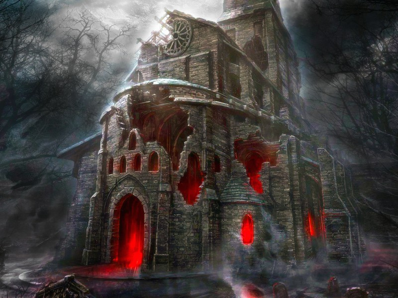

# Dungeon of Doom

This is going to be an easy and fun text based game that I work on periodically throughout my time in the Thinkful program.

The user will be able to travel through the woods and ultimately into a **castle** at night and find _items_ and fight _monsters_.

Items will be stored in the `state = {}`.

Thigns I would still like to implement:
* an engine that generates levels, which changes backgrounds, text, and eventually music?
* an array of monsters who are accessible through random encounters.
* a random dice roller to determine outcomes.

The journey will go as following:
1. start in the woods (straight forward).
2. enter the castle (two levels with different encounters, items, art, and textNodes).

Items to be discovered are:
* healing potions (restore the HP by 5).
* various weapons and shields (changes the users power and HP Bonus or AC).
* gold (just for fun, no purpose?  Maybe = score?).

Thanks!
